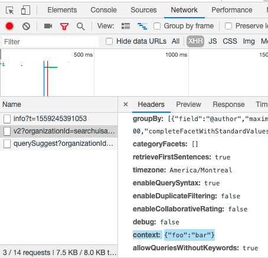
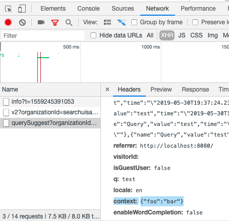

## Basic Usage

The CustomContext component in a Coveo Search interface.

```
 <body id='search' class='CoveoSearchInterface'>
    <div class='CoveoCustomContext' data-context='{"foo":"bar"}'></div>
```





## Options

### context : _[key: string]: any_

Specifies the context object to be sent along with the search queries

Example: `data-context='{"foo":"bar"}'`

Default value is `{}`.
