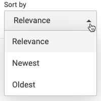

## Basic Usage

The SortDropdown displays Sort components in a dropdown.

```
<div class="CoveoSortDropdown" data-display-caption="true" data-caption="Sort by:">
    <span class="CoveoSort" data-sort-criteria="relevancy" data-caption="Relevance"></span>
    <span class="CoveoSort" data-sort-criteria="date descending" data-caption="Newest"></span>
    <span class="CoveoSort" data-sort-criteria="date ascending" data-caption="Oldest"></span>
</div>
```



## Options

### caption (optional) : _string_

Specifies the title caption of the component

Example: `data-caption='Sort:'`

Default value is `Sort By:`.

### displayCaption (optional) : _boolean_

Whether to display caption

Default value is `false`.

Example: ` data-display-caption='true'`

### displayAsSelect (optional) : _boolean_

Whether to display component as a good old HTML Select element.

Default value is `false`.

Example: ` data-display-as-select='true'`
